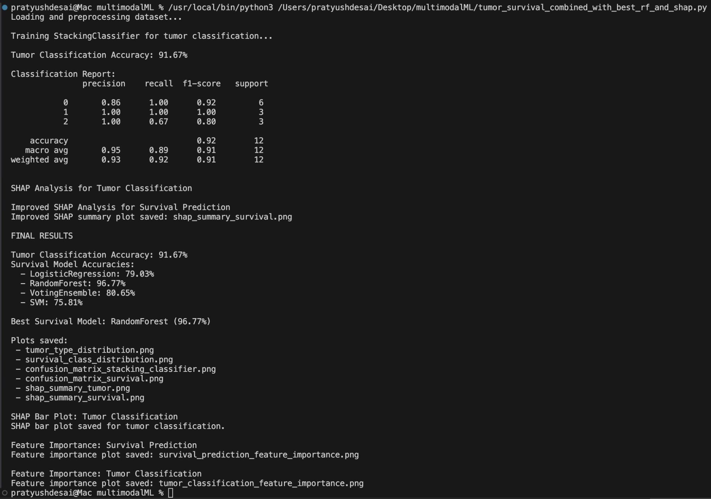
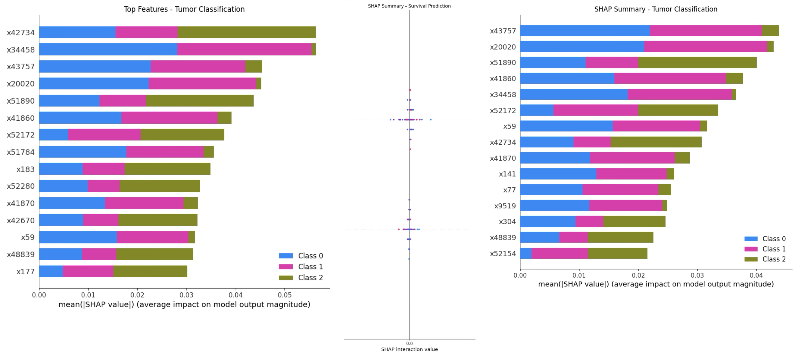
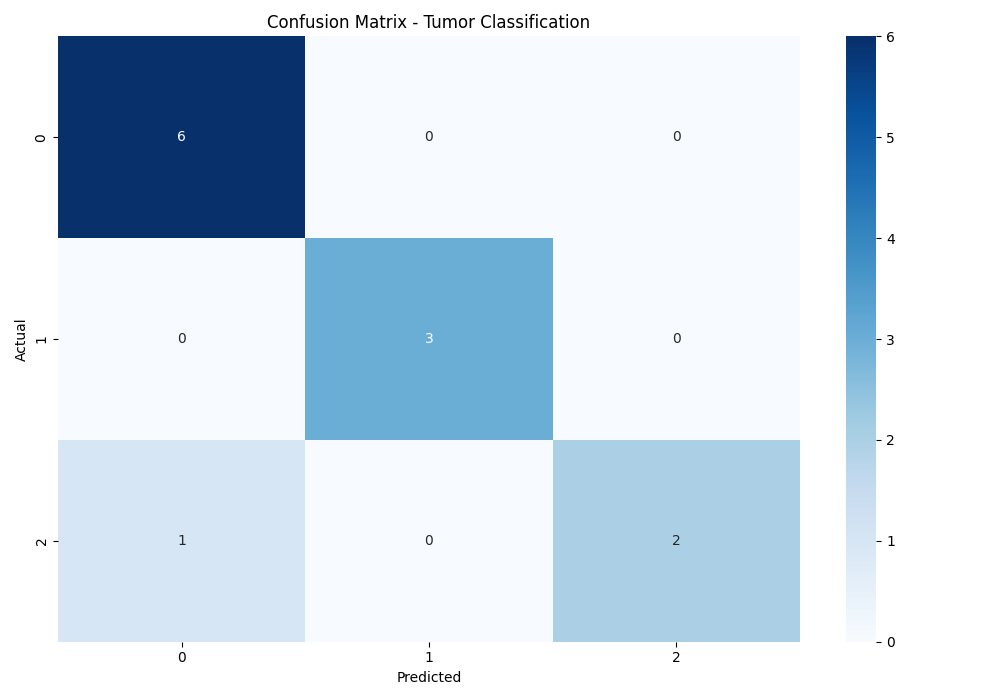
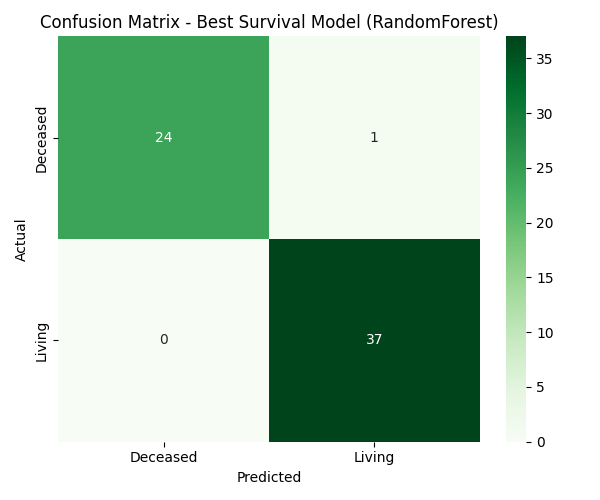
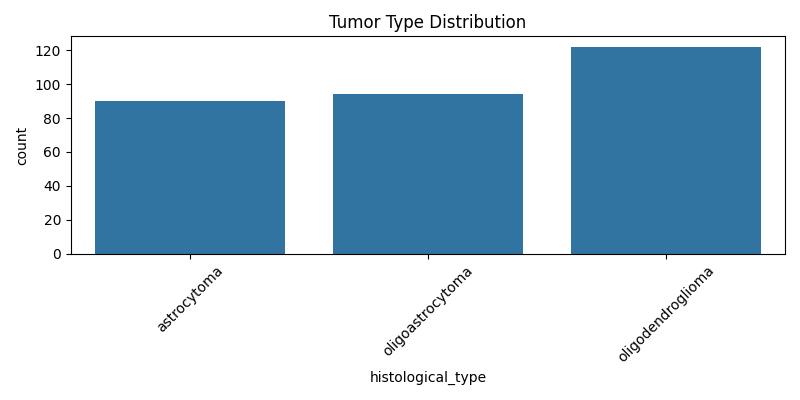
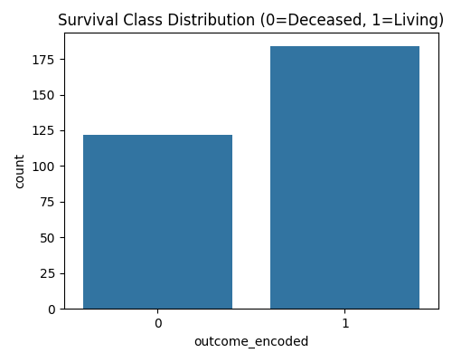

Project Title:
--------------
Glioma Tumor Classification and Survival Prediction using Machine Learning and SHAP

Files Included:
---------------
- tumor_survival_prediction_combined_with_shap.py  --> Final Python script
- Glioma-clinic-TCGA.xlsx                           --> Dataset file
- shap_summary_tumor_final.png                      --> SHAP plot for tumor classification
- shap_summary_survival_final.png                   --> SHAP plot for survival prediction
- tumor_classification_feature_importance.png       --> Feature importance (tumor)
- survival_prediction_feature_importance.png        --> Feature importance (survival)
- confusion_matrix_stacking_classifier.png          --> Tumor confusion matrix
- confusion_matrix_survival.png                     --> Survival confusion matrix
- roc_curve_survival.png                            --> Survival ROC curve

How to Run:
-----------
1. Install dependencies:
   pip install pandas numpy matplotlib seaborn scikit-learn imbalanced-learn shap openpyxl

2. Place both the .py script and the dataset in the same directory.

3. Run the program:
   python tumor_survival_prediction_combined_with_shap.py

Outputs:
--------
- Tumor classification and survival prediction results
- SHAP explainability plots
- Confusion matrices and ROC curves
- Feature importance visualizations

Techniques Used:
----------------
- KNN Imputation
- SMOTE and SMOTEENN
- Isolation Forest for outlier removal
- Feature selection (SelectKBest, RandomForest importance)
- StackingClassifier and VotingClassifier models
- SHAP-based interpretability

System Requirements:
---------------------
- Python 3.7+
- Minimum 8GB RAM recommended

Result:
---------------------

